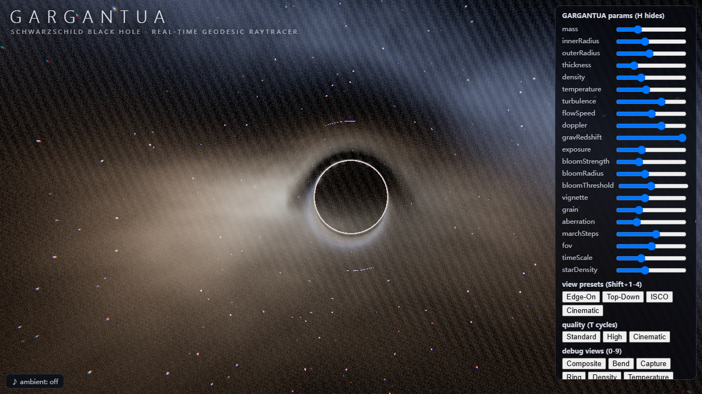

# GARGANTUA — Schwarzschild Black Hole Raytracer

A fullscreen interactive website that raytraces a Schwarzschild black hole **live in a
fullscreen fragment shader**: every pixel integrates a null geodesic
(`a = -1.5·h²·x/r⁵`), accumulating volumetric accretion-disk emission with
Doppler beaming and gravitational redshift, over a procedural starfield and
galaxy. No black spheres, no flat rings, no textures, no video — the image is
computed, not pasted. Built with plain HTML/CSS/JavaScript (ES Modules) plus a
locally vendored Three.js. No build step, no CDN, no runtime fetch.




Live demo (GitHub Pages, served while any machine is online — no need to keep a local computer running): https://ericwang1358.github.io/muse-qwen-blackhole/

Build log: [PROCESS.md](PROCESS.md) — all 173 rounds from blank page to this render, including every human prompt, the evidence chain, and why cheap models plus pairing discipline beat one-shot generation.

## Start

```powershell
cd gargantua
python -m http.server 8091
# open http://127.0.0.1:8091/index.html
```

Any static server works (`npx serve .`, `caddy file-server`, …).
Note: if port 8077 is taken on your machine by another listener, pick any free
port — the app has no hardcoded port.

## What you see

- **Event-horizon shadow** — rays captured at r < rs paint true black.
- **Photon ring** — thin bright ring from geodesics grazing 1.5·rs.
- **Volumetric accretion disk** — flared scale height H(r), multi-sample
  emission/absorption marched along each bent ray, fbm turbulence advected by
  Keplerian flow, white-hot inner rim to amber outer edge, approaching side
  Doppler-boosted, inner edge gravitationally red-shifted.
- **Procedural sky** — hash-based stars with twinkle plus a Milky Way band with
  dark lanes; the band itself is gravitationally lensed around the shadow.
- **Post chain** — HDR UnrealBloom (pre-tonemap), film grain, vignette, subtle
  chromatic aberration, single ACES via OutputPass.

## Controls

| Input | Action |
|---|---|
| drag / wheel / touch | orbit / zoom (OrbitControls, damped) |
| `0–9` | debug views: Composite, Bend, Capture, Ring, Density, Temperature, Doppler, Redshift, Sky, Absorbed |
| `Shift+1–4` | view presets: Edge-On, Top-Down, ISCO, Cinematic |
| `C` | resume cinematic auto-orbit (pauses on first drag) |
| `T` | cycle quality: Standard / High / Cinematic |
| `R` | reset all 21 params to defaults |
| `H` | hide / show HUD + title |
| right-click ♪ button | mute / unmute ambient (click = play/stop) |

The HUD exposes all 21 live parameters (mass, innerRadius, outerRadius,
thickness, density, temperature, turbulence, flowSpeed, doppler, gravRedshift,
exposure, bloomStrength, bloomRadius, bloomThreshold, vignette, grain,
aberration, marchSteps, fov, timeScale, starDensity), persisted to
`localStorage` (`gargantua.v1`, values clamped to slider ranges) together with
quality tier and camera.

## URL automation API (screenshots, no interaction)

- `?shot=1&view=X&frame=N&seed=S` — render N deterministic frames, download
  `gargantua-viewX-frameN-seedS.png` (pixel-deterministic: seeded sim time,
  frozen animation clock, no wall-clock input on the pixel path).
- `&preset=N` — first move the camera to view preset N (0–3).
- `&tier=NAME` — `Standard`, `High` or `Cinematic` (march steps / DPR / bloom).

## Layout

- `index.html` — fullscreen `canvas#scene`, title overlay, importmap to
  `./vendor/three`, module `js/main.js`.
- `css/main.css` — fullscreen/overlay styling incl. a narrow-viewport layout.
- `js/main.js` — boot, renderer/composer/grade chain, OrbitControls + presets
  + cruise + tiers, HUD/audio wiring, WebGL context-loss overlay with
  one-click recover, `?shot` capture, `#probe-state` self-report.
- `js/raytracer.js` — fullscreen geodesic integrator + sky + photon ring +
  debug views (imports `disk.js`).
- `js/disk.js` — volumetric disk model (density/temperature/velocity/
  Doppler/redshift, unit-max chromaticity, Kirchhoff-coupled transport).
- `js/params.js` — 21 defaults, ranges, quality tiers, presets, clamped store.
- `js/hud.js` — bespoke panel (sliders/buttons/keys, no widget vendor).
- `js/post.js` — grade pass (vignette/grain/dispersion).
- `js/audio.js` — procedural WebAudio ambient (seeded drone + noise wash),
  gesture-gated, never autoplay, mute persisted.
- `vendor/three/` — verbatim upstream `three@0.160.0` pinned for offline use.

## Vendor provenance

`vendor/three` is unmodified upstream `three@0.160.0` (`npm pack`, pinned for
offline reproducibility). A workspace-level shared copy may exist at
`../webgl-libs/` (newer three plus helper libs) but this deliverable stays
pinned as above; any upgrade is future work with its own re-measurement.
Note for source scanners: the only `.png` literal in first-party code is the
`?shot` download filename — there is no texture loading anywhere
(no `TextureLoader`, no image/video assets).

## Test evidence (acceptance run, headless Chrome + Python static server)

- All 7 first-party modules pass `node --check` as ESM (plain `--check`
  misparses `import` as CommonJS and false-fails; verified via `.mjs` copies).
- Zero page console errors/warnings on load (captured browser log).
- Pixel probes of the live render: deep-black shadow core, thin photon ring,
  Doppler-asymmetric turbulent disk, dark starfield with lensed band.
- `?shot` determinism: same URL twice yields byte-identical PNGs.
- Debug views 0–9 render distinct outputs (pairwise difference measured).
- Presets reachable via `Shift+1–4`, buttons and `?preset=`; tiers via `T` and
  `?tier=`; DPR clamped per tier; touch orbit via OrbitControls.
- Mobile 390px viewport: collapsible parameter panel, readable title.
